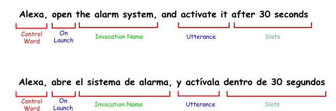
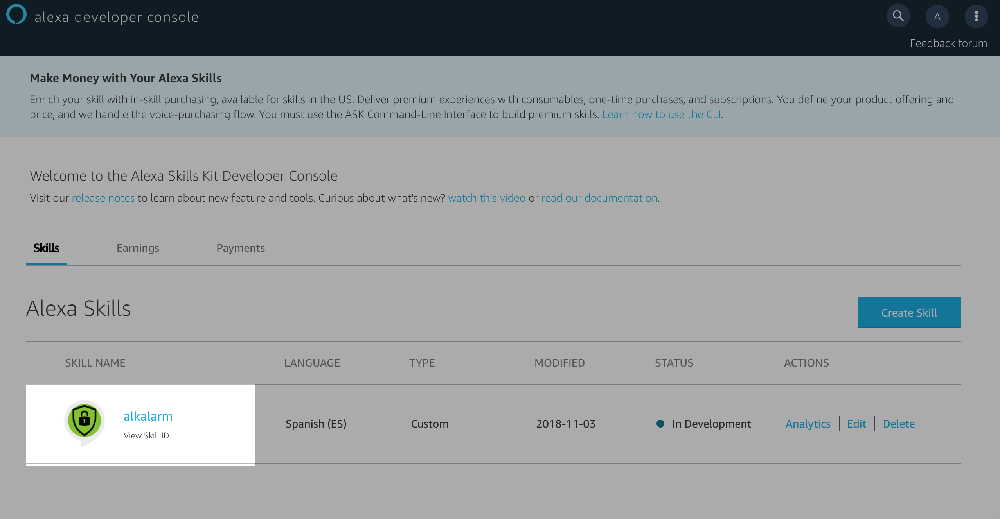
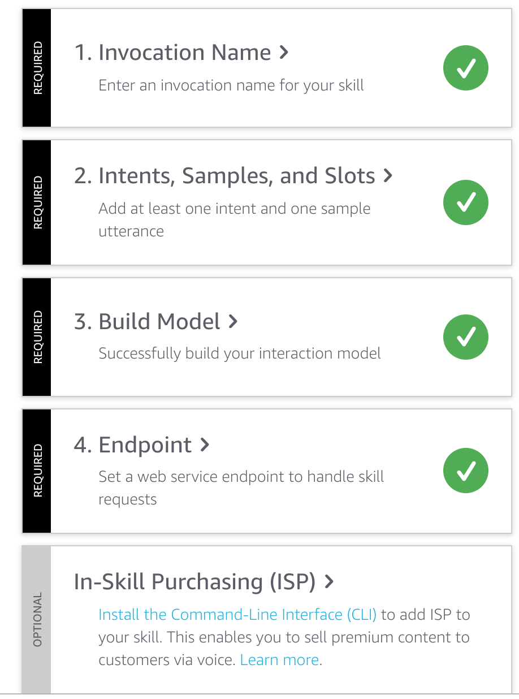
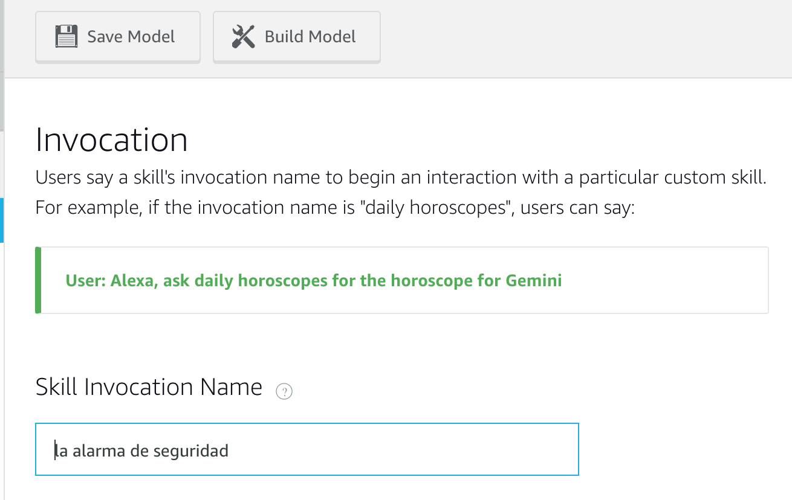
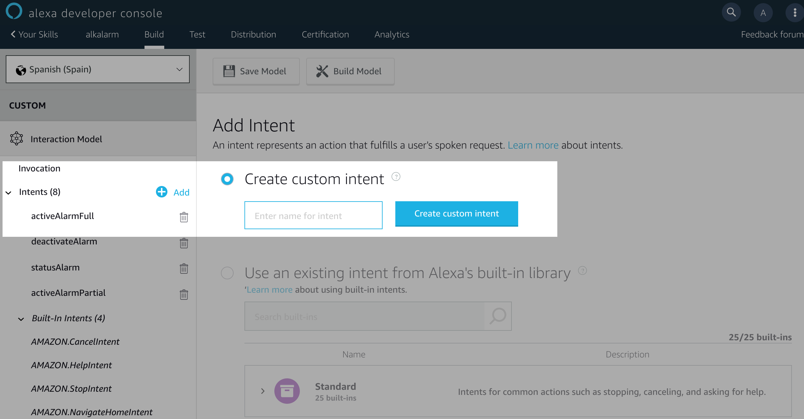
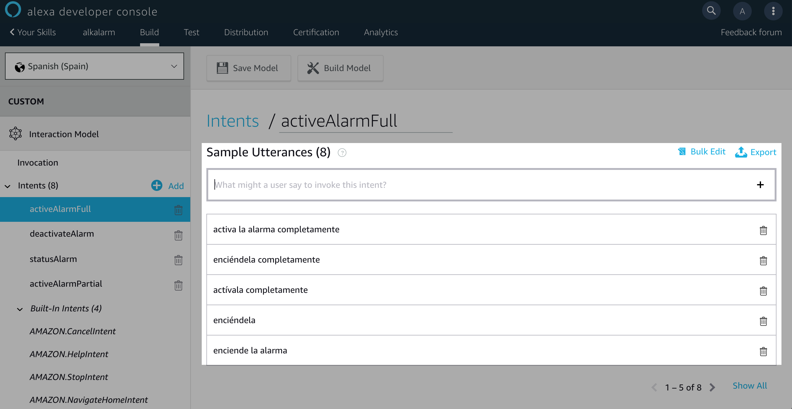
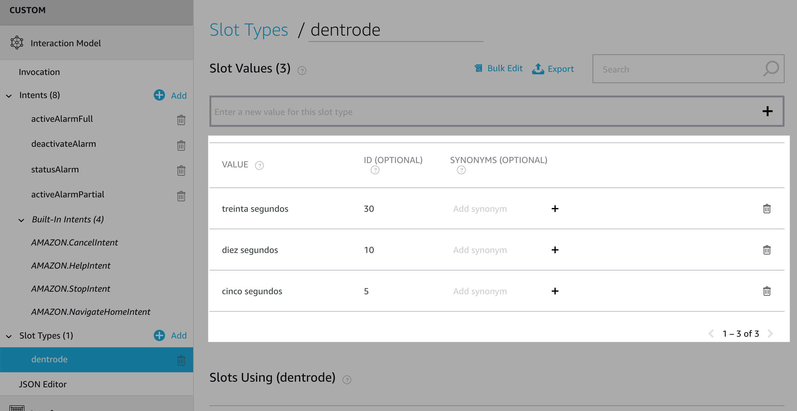
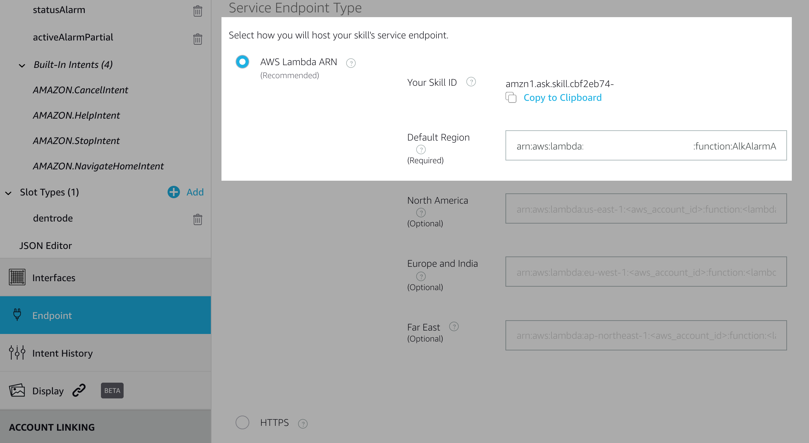
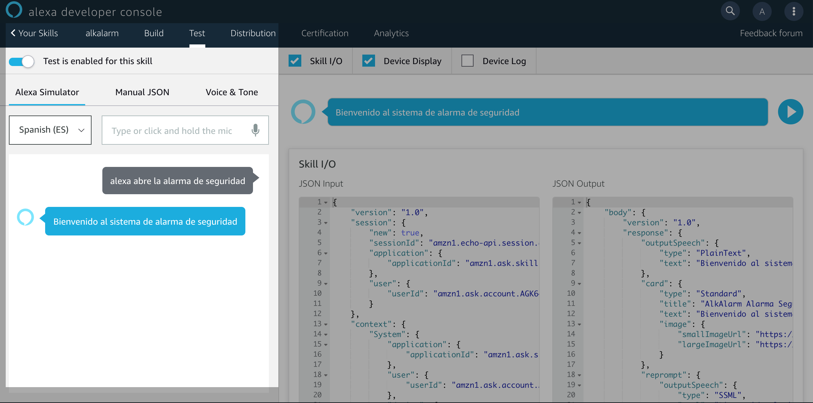
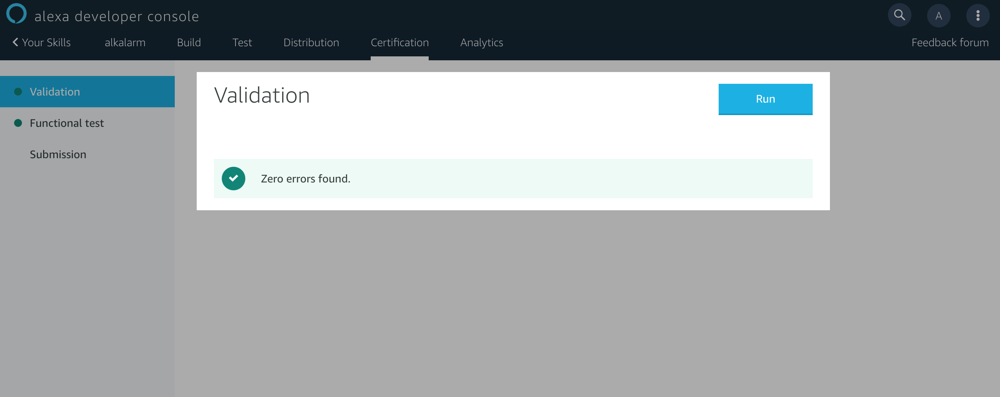

# Alkalarm-alexa-skills

This is the alexa skill for the alkalarm system project integration.

The main idea of this project is create an integration using alexa skills and the echo device
to control the "alkalarm" home security system.

For example, we could manage the alarm system using:

_**Alexa, open the alarm system, and activate it, after 30 second**_

_**Alexa, open the alarm system, and activate it just for the perimeter**_

_**Alexa, open the alarm system, and stop it**_

_**Alexa, tell me the alarm system state**_

## Alexa Skills Voice Processing Architecture

Just to keep in mind the steps that we have to do in order to create and integrate custom skills with the alkalarm
project, we're gonna review the main architecture of alexa skills processing:

As you can see, we have to define 3 things:

1-. Create your voice user interface for Alexa skill

2-. Create the skills definition in AWS Alexa development console.

3-. Create the lambda code to response the skills questions integrating that with your service.

## 1 - Create your voice user interface for alexa skills

First of all, reading the aws alexa development documentation you could find the voice structure in order to create the skill.
It's important to define a human language to make easy interact with Alexa without forcing the language.
In our skill we're gonna explain in two language (currently english and spanish), but the idea is the same for both of them:

The fields are:
 * **control word**: It's the main wake up word for alexa devices
 * **On Launch**: It's quite rare the first time, but if you're not developing an special built-in skill, you have to create OnLaunch 
 intent to "open" the skill with alexa. It was the most un-happpy thing that I've discovered, but if you define something like "open" make sense for the human language perspective.
 * **Invocation Name**: It's the name which alexa will use to know as the reference to your skill. It's recommend something that make sense and also with good pronunciation.
 At this point, the first approach was "alkAlarm", but doing tests, I discovered that it has a non-natural pronunciation in spanish for alexa. I changed it to "alarm system" which is more easy to understand for alexa.
 * **Utterances**: That's the most important part because it's your own creation to interact with the system. I recommend to create over 10 or more examples with synonymous 
 * **Slots**: It's so important if you want to create different behaviours of your system based on time, date, size, and so on.

## 2 - Create the Skill in AWS Alexa development console

The first thing that you have to do is create an account in Alexa development console (it's totally free):

After the first point, you could create a new skill:

The first point is create the next elements:

For the intent, you have to select the name keeping in mind the recommendation done before:

After that, we have to define the language to interact with alexa:

After we have all the phrases to interact with alexa, we have to define the reference to lambda using the endpoint section:
Let's came back here in the next session (after lambda creation phase)

Wow!!! Right now, we can test the application with the test feature console:

and test if the skill has any error to distribute to the real world ;)

